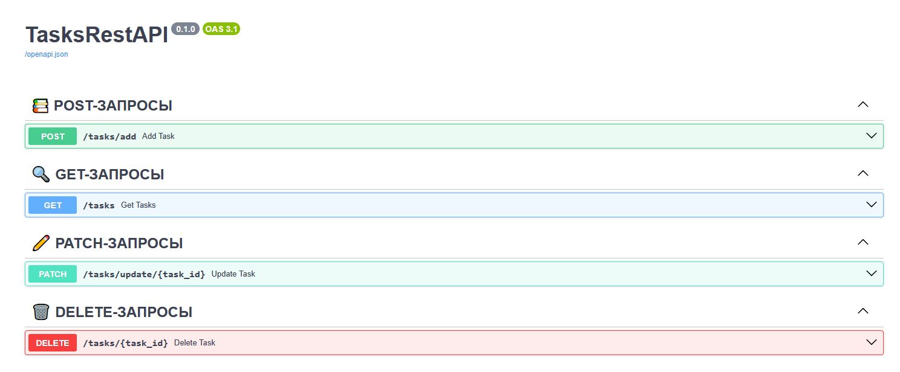

# TasksRestAPI

REST-API для to-do задач

## РАЗРАБОТАНО НА ФРЕЙМВОРКЕ FastAPI

 - [Документация FastAPI](https://fastapi.tiangolo.com/)

> [!IMPORTANT]    
> txt файл со всеми библиотеками в проекте - [requirements.txt](requirements.txt)

&copy; evr1lay 2026.